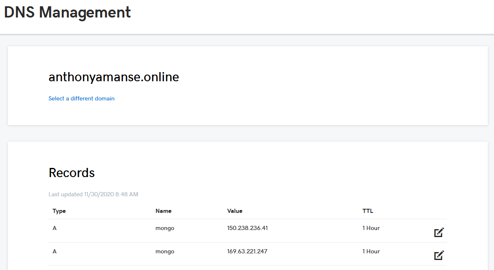

# Securing External Connections to MongoDB Enterprise on Red Hat OpenShift

In the previous tutorial [Secure MongoDB Enterprise on Red Hat OpenShift](https://developer.ibm.com/tutorials/secure-mongo-db-enterprise-on-red-hat-openshift), it walks you through deploying a MongoDB cluster and securing them properly. The tutorial only covers the use of the MongoDB cluster from resources inside the cluster. There are times where you would also want to expose them externally such that other resources outside your cluster can directly connect to it.

When it comes to exposing a database or other resources externally, security is one of the most important things to implement. It is important to have encryption and authentication so that only the right person or resources have access to it. This also means that your application's user data is well protected. The previous tutorial covers setting up encryption and authentication for your MongoDB cluster.

This tutorial shows you how to:
- Expose MongoDB Database from MongoDB Enterprise Operator
- Use a public domain name for the MongoDB
- Configure certificate to use the public domain name
- Connect to a MongoDB outside of OpenShift or Kubernetes

# Steps
1. [Complete the previous tutorial "Secure MongoDB Enterprise on Red Hat OpenShift"](#1-Complete-the-previous-tutorial-Secure-MongoDB-Enterprise-on-Red-Hat-OpenShift)
2. [Expose MongoDB replicas through NodePort](#2-Expose-MongoDB-replicas-through-NodePort)
3. [Configure domain name](#3-Configure-domain-name)
4. [Configure existing certificates](#4-Configure-existing-certificates)
5. [Configure MongoDB Database resource](#5-Configure-MongoDB-Database-resource)
6. [Test connection from client outside of OpenShift or Kubernetes](#6-Test-connection-from-client-outside-of-OpenShift-or-Kubernetes)

## 1. Complete the previous tutorial "Secure MongoDB Enterprise on Red Hat OpenShift"

The previous tutorial will walk you through installing the MongoDB Enterprise operator and deploy MongoDB resources. The tutorial also walks you through securing the MongoDB with authentication and encryption.

## 2. Expose MongoDB replicas through NodePort

Now that you have the MongoDB repica set ready, you can expose its replicas through NodePort. You can do this in the command line:

```
oc expose pod/example-mongo-0 --type="NodePort" --port 27017
oc expose pod/example-mongo-1 --type="NodePort" --port 27017
oc expose pod/example-mongo-2 --type="NodePort" --port 27017
```

You should see the following services created:
```
oc get services

NAME                   TYPE           CLUSTER-IP       EXTERNAL-IP    PORT(S)           AGE
example-mongo-0        NodePort       172.21.174.50    <none>         27017:31385/TCP   72m
example-mongo-1        NodePort       172.21.218.87    <none>         27017:30131/TCP   72m
example-mongo-2        NodePort       172.21.170.154   <none>         27017:30656/TCP   72m
...
```

## 3. Configure domain name

The previous tutorial only covered the use of MongoDB internally hence the certificate will only be valid for the internal domain name.

You can choose to do one of the following:
* [Use a public domain](#Use-a-public-domain)
* [Use a cluster node's IP address for testing](#Use-a-cluster-node's-IP-address-for-testing)

### Use a public domain
If you have a public domain ready for use, configure its A records to point to the IP addresses of your cluster nodes.

To get the cluster IP of your nodes:

```
oc get nodes -o wide

NAME           STATUS   ROLES           AGE   VERSION           INTERNAL-IP    EXTERNAL-IP      OS-IMAGE   KERNEL-VERSION                CONTAINER-RUNTIME
10.221.22.40   Ready    master,worker   66d   v1.17.1+c5fd4e8   10.221.22.40   169.xx.xx.xx     Red Hat    3.10.0-1127.19.1.el7.x86_64   cri-o://1.17.5-7.rhaos4.4.git6b97f81.el7
10.221.22.44   Ready    master,worker   66d   v1.17.1+c5fd4e8   10.221.22.44   150.xx.xx.xx     Red Hat    3.10.0-1127.19.1.el7.x86_64   cri-o://1.17.5-7.rhaos4.4.git6b97f81.el7
```

Example A record from a DNS Registrar



You can now proceed to the next step when your domain name is now pointing to the cluster nodes.

### Use a cluster node's IP address for testing

If you don't have a readily available public domain, you can use one of the cluster node's IP address with "nip.io". [nip.io](https://nip.io/) allows you to map the IP address to a hostname.

Get one of the cluster IP of your nodes:
```
oc get nodes -o wide

NAME           STATUS   ROLES           AGE   VERSION           INTERNAL-IP    EXTERNAL-IP      OS-IMAGE   KERNEL-VERSION                CONTAINER-RUNTIME
10.221.22.40   Ready    master,worker   66d   v1.17.1+c5fd4e8   10.221.22.40   169.xx.xx.xx     Red Hat    3.10.0-1127.19.1.el7.x86_64   cri-o://1.17.5-7.rhaos4.4.git6b97f81.el7
10.221.22.44   Ready    master,worker   66d   v1.17.1+c5fd4e8   10.221.22.44   150.xx.xx.xx     Red Hat    3.10.0-1127.19.1.el7.x86_64   cri-o://1.17.5-7.rhaos4.4.git6b97f81.el7
```

Then the hostname you'll be using for the next steps will be `<cluster-ip-address>.nip.io` (For example, `169.123.123.123.nip.io`).

## 4. Configure existing certificates

You can now add your domain name to the certificates you created from Step 1. You need to do this so that the certificate will be considered as valid.

Edit the `cert-manager/certificates.yaml` from your cloned repo. Add your domain name to each certificate resource in the `dnsNames` section. For example:
```
  dnsNames:
  - 169.123.123.123.nip.io
  - example-mongo-0.example-mongo-svc.mongodb.svc.cluster.local
---
  dnsNames:
  - 169.123.123.123.nip.io
  - example-mongo-1.example-mongo-svc.mongodb.svc.cluster.local
---
  dnsNames:
  - 169.123.123.123.nip.io
  - example-mongo-2.example-mongo-svc.mongodb.svc.cluster.local
```

Then apply the new configuration
```
oc apply -f cert-manager/certificates.yaml
```

You'll also need to update the PEM files used by the MongoDB so that it will use the updated certificates.
```
oc get secret example-mongo-0 -o jsonpath='{.data.tls\.crt}{.data.tls\.key}' | base64 --decode > example-mongo-0-pem

oc get secret example-mongo-1 -o jsonpath='{.data.tls\.crt}{.data.tls\.key}' | base64 --decode > example-mongo-1-pem

oc get secret example-mongo-2 -o jsonpath='{.data.tls\.crt}{.data.tls\.key}' | base64 --decode > example-mongo-2-pem
```

Delete the old secret and create a new one using the new PEM files
```
oc delete example-mongo-cert

oc create secret generic example-mongo-cert --from-file=example-mongo-0-pem --from-file=example-mongo-1-pem --from-file=example-mongo-2-pem
```
## 5. Configure MongoDB Database resource

Before connecting to the database externally, you will need to add your domain name with the node port in the replica set horizons in your MongoDB Database resource. You can do this by adding a spec `spec.connectivity.replicaSetHorizons` in your `deployment/2-mongodb-deployment.yaml` file from your cloned repo.

You can get the node port using:
```
oc get services

NAME                   TYPE           CLUSTER-IP       EXTERNAL-IP    PORT(S)           AGE
example-mongo-0        NodePort       172.21.174.50    <none>         27017:31385/TCP   72m
example-mongo-1        NodePort       172.21.218.87    <none>         27017:30131/TCP   72m
example-mongo-2        NodePort       172.21.170.154   <none>         27017:30656/TCP   72m
```

The replica set horizons values would be an array in the format of `<replica-set>: <domain-name>:<port>`

For example:
```
spec:
  connectivity:
    replicaSetHorizons:
    - example-mongo: 169.123.123.123.nip.io:31385
    - example-mongo: 169.123.123.123.nip.io:30131
    - example-mongo: 169.123.123.123.nip.io:30656
  # the name of the secret in 1-ops-manager-config-secret.yaml
  credentials: ops-manager-organization-apikey
  members: 3
  ...
```

Then apply the new configuration
```
oc apply -f deployment/2-mongodb-deployment.yaml
```

> Make sure TLS and authentication are still enabled!

## 6. Test connection from client outside of OpenShift or Kubernetes

Now that you have it enabled, you can test the connection by connecting it from your local machine. You can either use the `mongo` cli or use the example application from the previous tutorial.

If you have the `mongo` cli installed, you can execute:

```
mongo \
  --host example-mongo/169.63.221.247.nip.io:31385,169.63.221.247.nip.io:30131,169.63.221.247.nip.io:30656 \
  --tls \
  --tlsCAFile ca.crt \
  -u mongodb-example-user \
  -p password \
  --authenticationDatabase example

MongoDB shell version v4.4.1
connecting to: mongodb://169.xx.nip.io:31385,169.xx.nip.io:30131,169.xx.nip.io:30656/?authSource=example&compressors=disabled&gssapiServiceName=mongodb&replicaSet=example-mongo
Implicit session: session { "id" : UUID("15d79cf9-1017-4230-a1f3-5f5e312309ad") }
MongoDB server version: 4.2.2
WARNING: shell and server versions do not match
MongoDB Enterprise example-mongo:PRIMARY>
```

Or you can also use the example nodejs application from the previous tutorial.

Export the following environment variables with your public domain names and respective node ports.
```
cd example-applications/nodejs

export MONGODB_REPLICA_HOSTNAMES=169.123.123.123.nip.io:31385,169.123.123.123.nip.io:30131,169.123.123.123.nip.io:30656
export MONGODB_REPLICA_SET=example-mongo
export MONGODB_USER=mongodb-example-user
export MONGODB_PASSWORD=password
export MONGODB_AUTH_DBNAME=example
export MONGODB_CA_PATH=$(pwd)/../../ca.crt
export MONGODB_DBNAME=example
```

Run the example application:

```
npm install
node app.js
```

Then open `localhost:8080/api-docs` through your browser and try the APIs


# Conclusion

Hopefully this tutorial has shown you one of the ways you can expose a MongoDB Database so that external applications or resources can directly connect to it. In addition to that, the MongoDB database is secured with authentication and encryption which ensures your data is safe.

## Learn More

* [Learn more about using Mongoose with NodeJS](https://mongoosejs.com/docs/)
* [Learn about Data Modeling with MongoDB](https://docs.mongodb.com/manual/core/data-modeling-introduction/)
* [Official Docs on using MongoDB Enterprise Operator](https://docs.mongodb.com/kubernetes-operator/stable/)
* [Learn more about cert-manager](https://cert-manager.io/docs/)
* [Red Hat Marketplace](https://marketplace.redhat.com/)

## License

This tutorial is licensed under the Apache License, Version 2. Separate third-party code objects invoked within this tutorial are licensed by their respective providers pursuant to their own separate licenses. Contributions are subject to the [Developer Certificate of Origin, Version 1.1](https://developercertificate.org/) and the [Apache License, Version 2](https://www.apache.org/licenses/LICENSE-2.0.txt).

[Apache License FAQ](https://www.apache.org/foundation/license-faq.html#WhatDoesItMEAN)